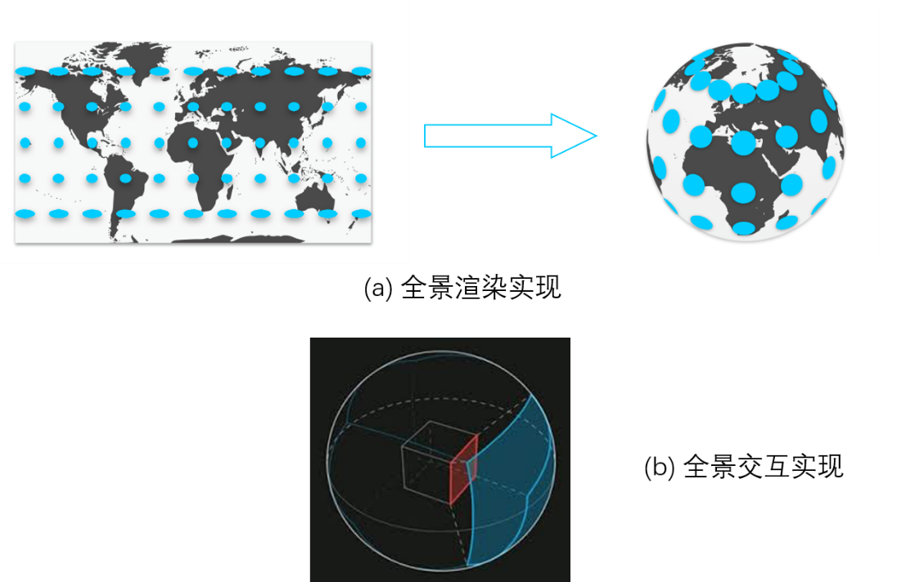
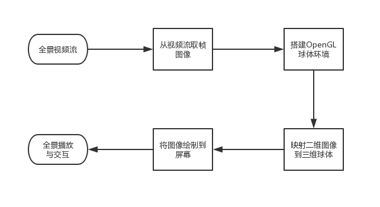
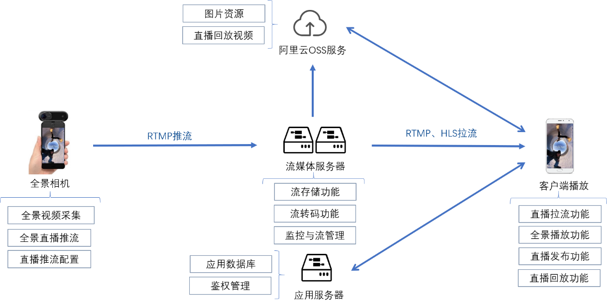
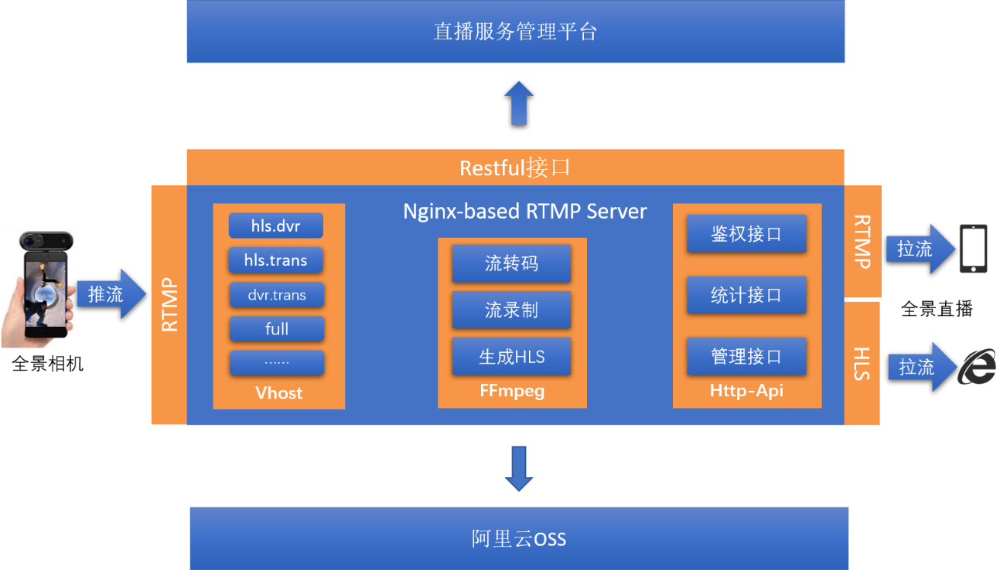
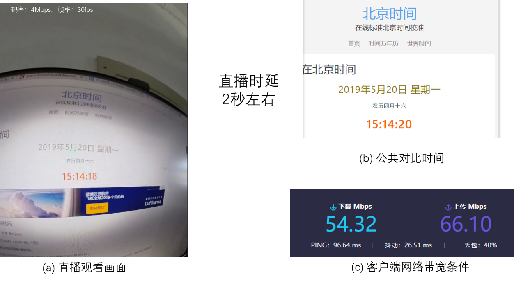
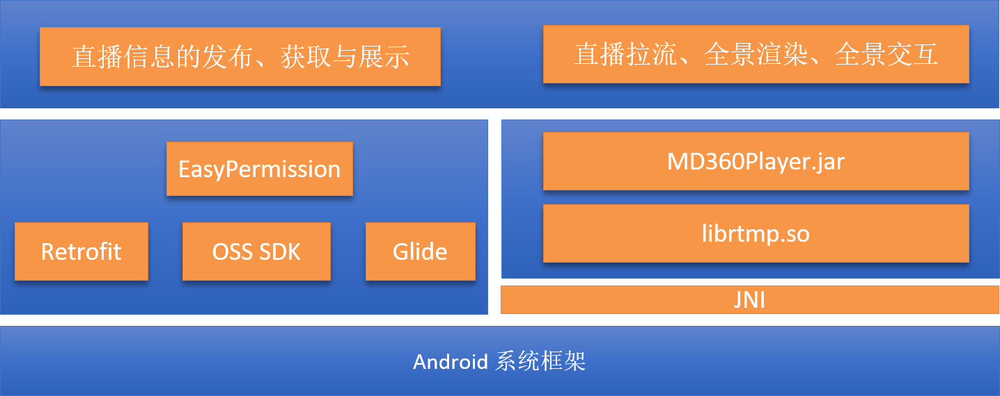
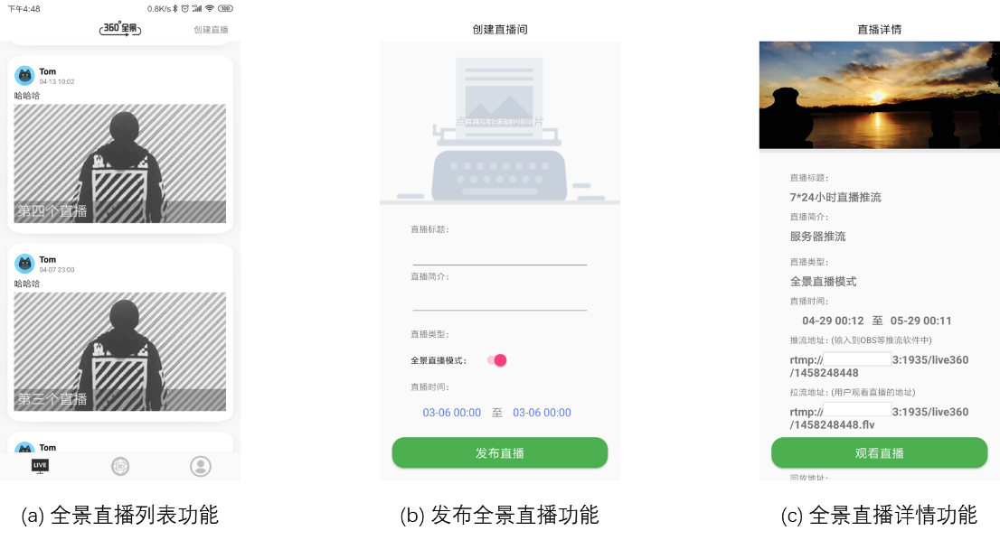
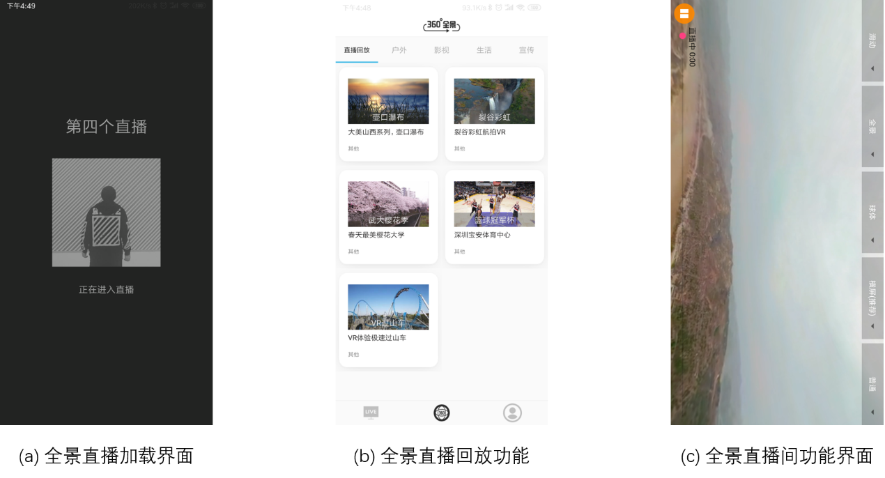
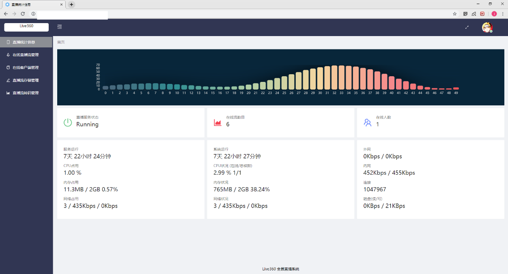
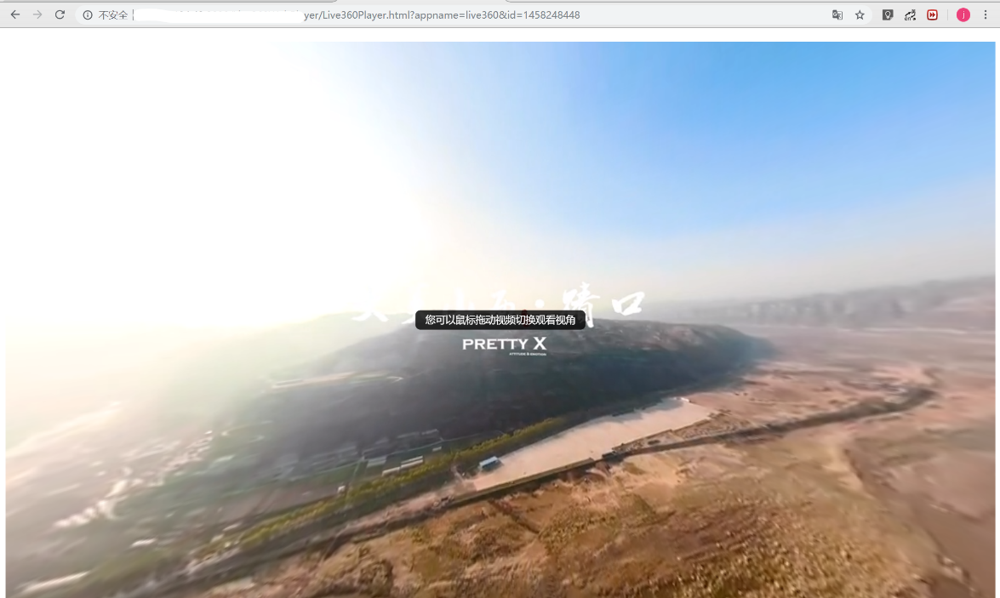

# Live360 移动全景视频直播系统

### 前言

- 关于开发实现，没什么好记录的，倒是整个调研和复杂系统的设计过程比较有意思。
- 2020.06补充：虽然现在看觉得方案还有很多不完善的地方，但确实是本科阶段设计的比较复杂的系统了，挺有纪念意义。

### 关于Live360

Live360系统以功能一体化的全景相机（Insta360）作为前端采集设备，通过RTMP协议将全景画面推流到流媒体服务器并通过安卓客户端进行直播拉流和全景播放。同时流媒体服务器还进行了流转码、流存储以及支持HLS直播等流处理操作以支持直播清晰度切换、回放以及网页端播放等常用功能。

本项目为Live360系统安卓端APP项目

其他相关项目：
1. SRS流媒体服务器：[SRS](https://github.com/ossrs/srs), Live360所采用的开源流媒体服务器，感谢大佬们，解决我大难题，国产开源之光。
2. 管理前端项目地址：[Live360Manager](https://github.com/ZWboy97/Live360Manager)
1. 网页全景播放项目：[Live360WebPlayer](https://github.com/ZWboy97/Live360WebPlayer)
1. 后端服务器项目地址：[Live360Server](https://github.com/ZWboy97/live360Server)
1. 安卓端项目地址：[Live360Android](https://github.com/ZWboy97/Live360)

### Insta360全景相机
- Live360所采用的全景相机，可以连接智能手机，进行直播推流。
- Insta360地址：[Insta360 One 官网](https://www.insta360.com/product/insta360-one/)

 

1)	全景图片：分辨率6912*3456，输出格式INSP、JPG、RAW。
2)	全景视频：分辨率@帧率3840*1920@30fps、2560*1280@60fps、 2048*512@120fps,输出格式：INSV、MP4。
3)	全景直播：支持RTMP推流、支持推流到常用社交媒体以及自定义直播地址、码率可选1Mbps-8Mbps、帧率30fps、分辨率可选720P、1080P、1440P。
4)	其它支持：机内拼接、蓝牙4.0、通过Type-C或者Lighting接口连接智能手机、锂电池移动拍摄等。

- 再放两个图，关于全景原理以及全景渲染流程的

 

 

### Live360系统架构
完整的系统架构图

 

对于全景视频采集部分，使用目前市面上已有的消费级功能一体化全景相机作为前端采集设备（Insta360），通过连接智能手机完成全景采集、拼接、投影、编码以及推流等一系列流程。智能手机通过RTMP流媒体协议将全景画面推流到流媒体服务器，全景播放端通过RTMP或者HLS协议拉流并进行全景渲染。

为了支持全景直播的多码率切换以及直播回放功能，在流媒体服务器上需要部署流转码与流录制服务。流转码服务将直播流转码成更低码率和分辨率的一路新的直播流，与原始流一同可以被用户端拉流播放。流录制功能实现将直播流录制成视频文件以实现直播的回放点播功能，由于视频的点播服务同样需要占用大量的网络带宽，为了减轻流媒体服务器的网络压力，目标系统使用阿里云等公有云提供的OSS服务存储直播录制的视频文件。

应用服务器上部署了目标系统的后台数据库，同时部署Restful Api服务为客户端提供后台数据支持。推荐将目标系统的应用服务器与流媒体服务器分开部署在两个主机上，使得应用服务器服务质量不受流媒体服务器流量波动的影响，以保障即便在直播服务不响应的情况下用户端直播信息功能模块依然能正常使用。

对于直播监控管理Web平台，为了获得实时同步的直播监控数据，其后端数据服务将主要由流媒体服务器提供。而对于涉及账号、鉴权等功能，流媒体服务器通过网络回调远程调用应用服务器上提供的账号验证与鉴权功能。

### Live360流媒体服务器
流媒体服务器基于大名鼎鼎的[SRS](https://github.com/ossrs/srs)开源流媒体服务器开发，国产开源之光，感谢大佬们提供的开源解决方案，采用SRS基本一个互联网直播平台需要的能力基本都能实现，较难的是实现支持大规模直播分发以及低时延等优化和运营。
流媒体部分使用到了SRS提供的流录制、流转码、HLS切片、HTTP-API、回调接口等能力。录制到阿里云OSS的部分，通过OSS的SDK实现。

 

对直播时延进行了测试，能做到两秒的延时。

### Live360安卓端
安卓端全景播放器，自己撸是不会自己撸的，依然得抱紧开源大佬的腿，感谢开源项目[MD360Player](https://github.com/ashqal/MD360Player4Android)的大佬们。

安卓端是花费时间比较多的部分，自己也进行了比较充分的架构设计，也用上了Retroift、Kotlin等新东西。

### Live360管理端
管理端主要基于SRS流媒体服务器提供的Http-API接口作为后端数据来源，提供了流监控、流预览、流踢出等功能。前端部分采用React框架进行开发，界面采用了蚂蚁金服的[Ant Design](https://ant.design/index-cn)。

### Live360后端
后端基于Spring框架开发，直接上了SpringBoot，第一次上手，感觉还挺有呀，十分好用。

### 网页端全景播放
没错，当然还是抱紧开源大佬的大腿拉，基于video.js提供的开源播放器库，直播协议采用的hls。
整个开发过程还好，唯一蛋疼的是hls是基于HTTP的，所以会存在跨域问题，这个问题可以阻挠了我好一阵，逼得我把HTTP给学了一通，现在反过来看，当时自己咋就被这么个问题给干趴下了，不就一个google的事嘛？

### 系统演示
- 安卓APP

 

- 管理端

- Web全景播放器

